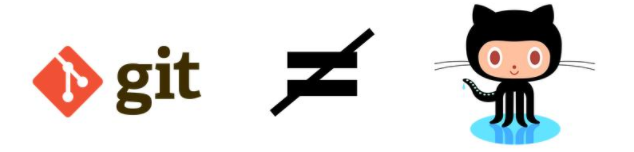
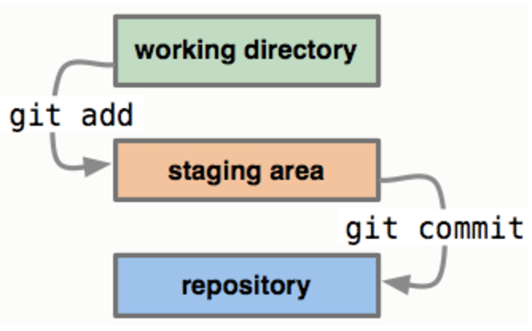
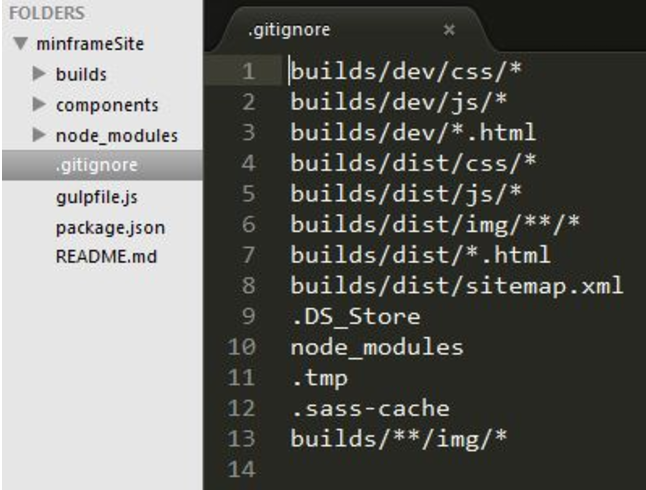

# git para dummies_

## 1.¿Qué es git?

Es importante dejar claro que git no es lo mismo que GitHub, git es un sistema de control de versiones Open Source creado en el año 2005 por Linus Torvalds, el creador de Linux, por otro lado GitHub es un servicio de alojamiento para proyectos versionados con git, de esta forma podemos tener una copia local y una remota de nuestros repositorios.

Con git podemos entre otras cosas: tener un control de ediciones versionadas, regresar a versiones anteriores de nuestros proyectos, revisar el registro de cambios y crear ramas experimentales o mejoras paralelas al proyecto troncal.

## 2.Instalación
Primero debes descargar e instalar la versión de git para tu sistema operativo desde https://git-scm.com/downloads

Para comprobar que la instalación fue realizada en la terminal de comandos escribes
`git --version`, si fue instalado verás la versión de tu instalación de git.

## 3.Configuración básica
Es importante configurar al menos un nombre de usuario y un correo electrónico, para ello escribes en la terminal `git config --global user.name ‘tunombre’`, pasando entre comillas tu nombre de usuario y `git config --global user.email tuemail` pasando sin comillas tu email.

## 4.Inicializar un repositorio
Para que la carpeta de un proyecto en tu equipo pase a ser un repositorio de git debes inicializarla, en la terminal debes posicionarte en la carpeta del proyecto y escribir `git init`, esto creará una carpeta oculta de nombre .git la cual contiene toda la información del versionamiento.

A continuación se hace necesario comprender los estados de git en nuestro repositorio local y los comando necesarios para movernos entre ellos.

En la imagen de referencia se describen tres estados: el working directory, este es el sistema de archivos en el cual trabajamos, el staging area, un área temporal en el que añadimos los archivos cuyos cambios estamos por enviar a git y el repository, donde se versiona nuestro trabajo.

## 5.Añadir archivos, status y commit
Para añadir cambios al staging area, lo haces con `git add .` para incluir los cambios realizados en todos tus archivos y `git add archivo.txt` si lo que quieres es incluir los cambios de un archivo en particular.

Para comprobar el estado de los archivos escribimos `git status`, de esta forma sabrás cuales están en el staging area listo para ser enviados al repositorio.

Para añadir los cambios que están en espera al repositorio escribes `git commit -m ‘Mensaje que explique la función del commit’`, con el flag -m pasa un mensaje entre comillas que entregue detalles del cambio añadido, el commit crea puntos de control en la línea de tiempo de tu repositorio.

Para utilizar un solo comado y realizar el git add + git commit puedes utilizar el flag -a, de la siguiente manera `git commit -a -m ‘Mensaje que explique la función del commit’`.

Si agregaste algún cambio al staging area pero quieres quitarlo de ahí puedes escribir 
`git reset HEAD archivo.txt`

## 6.Ignorar y borrar archivos
En cada proyecto hay archivos que no deseas versionar ya sea por su peso o su formato, para esto es que git te permite crear el archivo .gitignore dentro del cual debes detallar las carpetas o archivos que serán ignorados. A continuación un ejemplo.

Para borrar los cambio realizados en un archivo, en otras palabras regresar a su última versión guardada o si borraste por error un archivos que ya había sido enviado en un commit antes y quieres restaurarlo debes escribir en la línea de comandos `git checkout archivo.txt`, entonces git lo regresará a su última versión.

Si lo que quieres es borrar un archivo del repositorio debes ejecutar el comando `git rm archivo.txt`, en el próximo commit el archivo será removido. 

## 7.Usando ramas
Con el comando `git log` puedes ver el historial de commits enviados al repositorio con los datos del usuario que los realizó, un ID único y el comentario de referencia que explica su función. Si lo que deseas es retroceder hasta una versión ‘x’, solo debes escribir en la terminal el siguiente comando `git checkout IdCommit` donde IdCommit son los primeros 7 caracteres del ID proporcionado en el log. Para crear una rama de desarrollo desde ese punto o desde donde te encuentras debes ejecutar `git checkout -b NombreRama`

Ahora te encuentras en otra rama, puedes crear cuantas quieras y pasa saber sus nombre y navegar luego entre ellas es que puedes ejecutar `git branch`

Es importante mencionar que la rama troncal tiene por nombre master. Si lo que necesitas es regresar de una rama a master o simplemente moverte de una rama a otra ejecutas `git checkout NombreRama`

Para subir tu rama local al repositorio remoto (en el cual la rama no esta creada), ejecutas `git push origin NombreRama`, este comando se utiliza con más frecuencia para subir los cambios realizados en el repositorio local, luego darles commit, hacia el repositorio remoto. Para traer los cambios que otro integrante del equipo subió en una rama a tu repositorio local ejecutas `git pull origin NombreRama`, puedes traer cambios tu misma rama en su version remota o de otra rama con la cual quieras actualizar la tuya.

En el caso de querer borrar una rama, ejecutas `git branch -D NombreRama` forzando el borrado de una rama sin haber ejecutado antes un merge. Para fusionar dos ramas o hacer un merge, debes estar sobre la rama que quieres que permanezca (ej: hacer un merge de un feature a la rama develop) y ejecutas el comando `git merge NombreRama` donde NombreRama el nombre de la rama que queremos integrar. Luego podemos si lo deseas, puedes borrar la rama ejecutando `git branch -d NombreRama`

## 8.Repositorio remoto
GitHub es una de la posibilidades que tienes para crear tu repositorio de forma remota. Para ello debes crear un repositorio, darle un nombre y si quieres escribes una descripción. El comando que te permite asociar tu repositorio local (previamente inicializado) con el remoto es: 
`git remote add origin https://github.com/nombre-usuario/nombre-repositorio.git`
luego para subir el repositorio local ejecutas git push -u origin master, origin master es como se nombra a este repositorio remoto.

Si lo que deseas es descargar tu repositorio en otro equipo puedes clonar tu repositorio remoto con el comando: 
`git clone https://github.com/nombre-usuario/nombre-repositorio.git` 

Por último ya que alguien más del equipo de desarrollo pudo haber subido algún cambio, para no estar trabajando en una versión desactualizada debes bajar la última actualización de tu repositorio remoto a tu local, esto se hace con `git pull origin master`. Pull trae los cambio y push los envía.

## 9.Resumen de comandos git

|comando                  | función                                                    |
|-------------------------|------------------------------------------------------------|
| git init                | inicializa un repositorio                                  |
| git add                 | agrega cambios a staging area                              |
| git status              | muestra el estado de los cambios                           |
| git reset HEAD          | elimina un cambio del staging area                         |
| git commit              | envía un cambio del staging al repositorio                 |
| git rm                  | borra cambio del repositorio                               |
| git checkout            | trae la última versión del cambio, crea y cambia de rama   |
| git branch              | muestra las ramas                                          |
| git merge               | fusiona las ramas                                          |
| git remote add origin   | relacionar repo local a un repo remoto                     |
| git clone               | clonar repositorio remoto                                  |
| git pull                | trae la última versión del repo remoto                     |
| git push                | envía los cambio al repo remoto                            |

## 10.Resumen comandos consola

|comando                   | función                                                    |
|--------------------------|------------------------------------------------------------|
| pwd (unix) - cd (windows)| muestra el directorio actual                               |
| cd  + directorio         | cambio de directorio                                       |
| ls (unix) - dir (windows)| listar archivos del directorio                             |
| cd ..                    | sube un directorio                                         |

### Fuentes
  
* Git - la guía sencilla
    http://rogerdudler.github.io/git-guide/index.es.html
* Te enseño git en 30 minutos
    https://www.youtube.com/watch?v=QGKTdL7GG24
* Git: Subir un proyecto a Github
    https://www.youtube.com/watch?v=RRegIKu-z3k
* Curso gratis Devcode git y github
    https://devcode.la/cursos/git/
